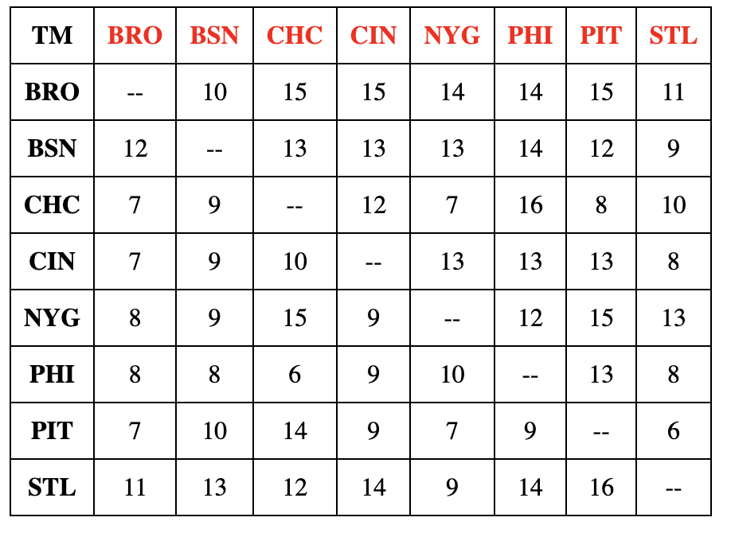

# Why I Want To Intern At Sport Reference / Why I Should Be Hired

I am excited about the prospect of interning at Sports Reference because it presents a unique opportunity to merge my passion for sports statistics with my love for web development. Since I first gained access to the internet, Sports Reference has been my go-to source for in-depth sports data and statistics. Combining my technical skills with my unwavering enthusiasm for sports, I am eager to contribute to the team's success.

My strong technical background equips me with the skills necessary for the role, and I am confident in my ability to excel in a web development capacity. Furthermore, my genuine love for sports aligns perfectly with the mission and values of Sports Reference, making me a dedicated and enthusiastic candidate for this position.

I believe that my unique blend of technical expertise and passion for sports will not only allow me to thrive in this role but also make a meaningful contribution to the Sports Reference team. I am committed to delivering high-quality work, and I am excited about the opportunity to contribute to the continued success of Sports Reference.
## Engineering Application Prompt

The web page uses the following technologies and techniques:

- **HTML/CSS**: The structure of the web page is defined using HTML. The table is created using HTML `<table>`, `<tr>`, and `<td>` elements along with basic inline CSS styles.

- **JavaScript**: JavaScript is used to dynamically populate the table with head-to-head records from the provided JSON data. The core logic of the JavaScript code is explained below:

    - **Data Structure**: The head-to-head records are stored in a JavaScript object in JSON format. The object is organized as a nested structure, where each team has a sub-object containing its records against other teams.

    - **Looping Through Data**: To build the head-to-head records table, JavaScript uses nested loops. The outer loop iterates through each team (e.g., 'BRO', 'BSN'), while the inner loop iterates through the same list of teams. This double-loop structure allows the code to compare each team's records against every other team.

    - **Conditional Display**: To handle the special case when two teams are the same (e.g., 'BRO' vs. 'BRO'), a conditional check is performed. If the two teams are the same, the cell in the table displays '--' instead of '0'.

- **JSON Data**: The JavaScript object that stores head-to-head records is populated with data from the provided JSON structure. This data is easily accessible and allows for flexible updates to the records.

## Usage

To view the head-to-head records table, follow these steps:

1. Clone or download this repository to your local machine.

2. Open the `index.html` file in a web browser.

3. The web page will display the table with the head-to-head records for the teams.

## Example

Here is a screenshot of the table displayed on the web page:

